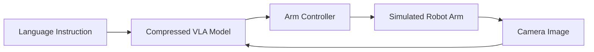

# ECE535-NetworkedEmbedded-RoboticManipulator
Course Project for ECE 535 Networked Embedded Systems - Robotic Manipulator with Visual Language Action Models (VLA's)
Team Members: Sean DiMattio, April Ramsey 

## Motivation
Vision-Language-Action models let people control robots with natural language instead of
hand-coded trajectories. But models like OpenVLA have 7B parameters, which makes them hard to run on 
hardware with limited memory. This project explores compressing a VLA to fit within 16GB
and running it on a simulated arm.

## Design Goals
- Run OpenVLA inference on a simulated robotic arm from language instructions
- Compress the 7B model to fit within a 16GB memory budget
- Evaluate the tradeoff between compression level, memory, latency, and task success

## Deliverables
1. Summary of how VLA models work 
2. Compressed OpenVLA model running within 16GB
3. Pick-and-place environment in Gazebo integrated with the compressed model
4. Evaluation of success rate, memory, and latency across compression levels

## System Blocks

## Hardware / Software Requirements
**Hardware:** NVIDIA RTX GPU with at least 16GB VRAM
**Software:** Ubuntu 22.04, Gazebo, Python

## Team Responsibilities/Lead Roles
Sean DiMattio: Gazebo environment, controller integration, model-to-simulator interface
April: OpenVLA setup, model compression

## Project Timeline

## References
1. OpenVLA: An Open-Source Vision-Language-Action Model. (https://arxiv.org/pdf/2406.09246)
2. Rethinking the Practicality of Vision-language-action Model: A Comprehensive Benchmark and An Improved Baseline. (https://arxiv.org/pdf/2602.22663) (https://github.com/OpenHelix-Team/LLaVA-VLA)
3. NVIDIA, Training Healthcare Robots from Scratch with Isaac for Healthcare. (https://docs.nvidia.com/learning/physical-ai/getting-started-with-isaac-for-healthcare/latest/training-healthcare-robots-from-scratch/04-model-flywheel/03-deploy.html)
4. Gazebo. (https://gazebosim.org)
